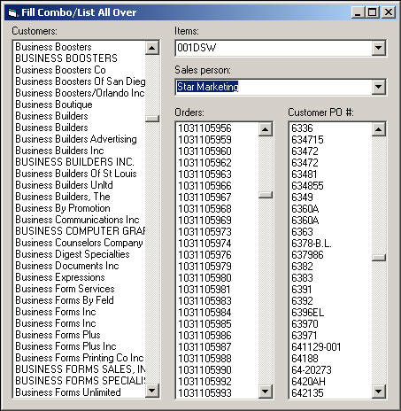

<div align="center">

## Fill Combo\\List All Over


</div>

### Description

Use one generic sub to fill all comboboxes or listboxes on your form(s), with data pulled out from database.
 
### More Info
 
Tablename, fieldname, optional comboname, optional listboxname, optional orderbyfield

This code is using ADO control, and uses two comboboxes and three listboxes on a form.

Fills combobox or listbox with data from database.


<span>             |<span>
---                |---
**Submitted On**   |
**By**             |[Shauli](https://github.com/Planet-Source-Code/PSCIndex/blob/master/ByAuthor/shauli.md)
**Level**          |Advanced
**User Rating**    |4.8 (19 globes from 4 users)
**Compatibility**  |VB 6\.0
**Category**       |[Databases/ Data Access/ DAO/ ADO](https://github.com/Planet-Source-Code/PSCIndex/blob/master/ByCategory/databases-data-access-dao-ado__1-6.md)
**World**          |[Visual Basic](https://github.com/Planet-Source-Code/PSCIndex/blob/master/ByWorld/visual-basic.md)
**Archive File**   |[](https://github.com/Planet-Source-Code/shauli-fill-combo-list-all-over__1-53957/archive/master.zip)


### Source Code

```
Option Explicit
'decalre connection and recordset
Dim myConn As ADODB.Connection
Dim myRecSet As ADODB.Recordset
Private Sub Form_Load()
Set myConn = New ADODB.Connection
Set myRecSet = New ADODB.Recordset
myConn.CursorLocation = adUseClient
'modify your connection string
myConn.Open "PROVIDER=Microsoft.jet.OLEDB.4.0;data source=C:\game.mdb;"
'modify with tablename, fieldname, optional comboname, optional listboxname, optional orderby
Call Fill_ComboAllOver("tablename", "fieldname", , List1, "fieldname")
'modify with tablename, fieldname, optional comboname, optional listboxname, optional orderby
Call Fill_ComboAllOver("tablename", "fieldname", Combo1) 'no orderby specified
'modify with tablename, fieldname, optional comboname, optional listboxname, optional orderby
Call Fill_ComboAllOver("tablename", "fieldname", Combo2, , "fieldname")
'modify with tablename, fieldname, optional comboname, optional listboxname, optional orderby
Call Fill_ComboAllOver("tablename", "fieldname", , List2, "fieldname")
'modify with tablename, fieldname, optional comboname, optional listboxname, optional orderby
Call Fill_ComboAllOver("tablename", "fieldname", , List3) 'no orderby specified
End Sub
Private Sub Form_QueryUnload(Cancel As Integer, UnloadMode As Integer)
myConn.Close
End Sub
Public Sub Fill_ComboAllOver(ByVal sbTableName As String, ByVal sbFieldName As String, _
    Optional ByRef comboName As ComboBox, Optional ByRef listName As ListBox, _
    Optional ByVal sbOrder As String)
On Error Resume Next
'if no orderby sepcified, use the fieldname instead
If sbOrder = "" Then sbOrder = sbFieldName
'clear the combo or the listbox
comboName.Clear
listName.Clear
'open recordset
DoEvents
 myRecSet.CursorLocation = adUseClient
 myRecSet.Open "SELECT " & sbFieldName & " FROM " & sbTableName & " order by " & sbFieldName & ";", myConn, adOpenKeyset, adLockReadOnly
  With myRecSet
  Do Until .EOF
   'fill combo or listbox
   comboName.AddItem .Fields(sbFieldName)
   listName.AddItem .Fields(sbFieldName)
  .MoveNext
  Loop
  End With
 myRecSet.Close
 Set comboName = Nothing
 Set listName = Nothing
End Sub
```

